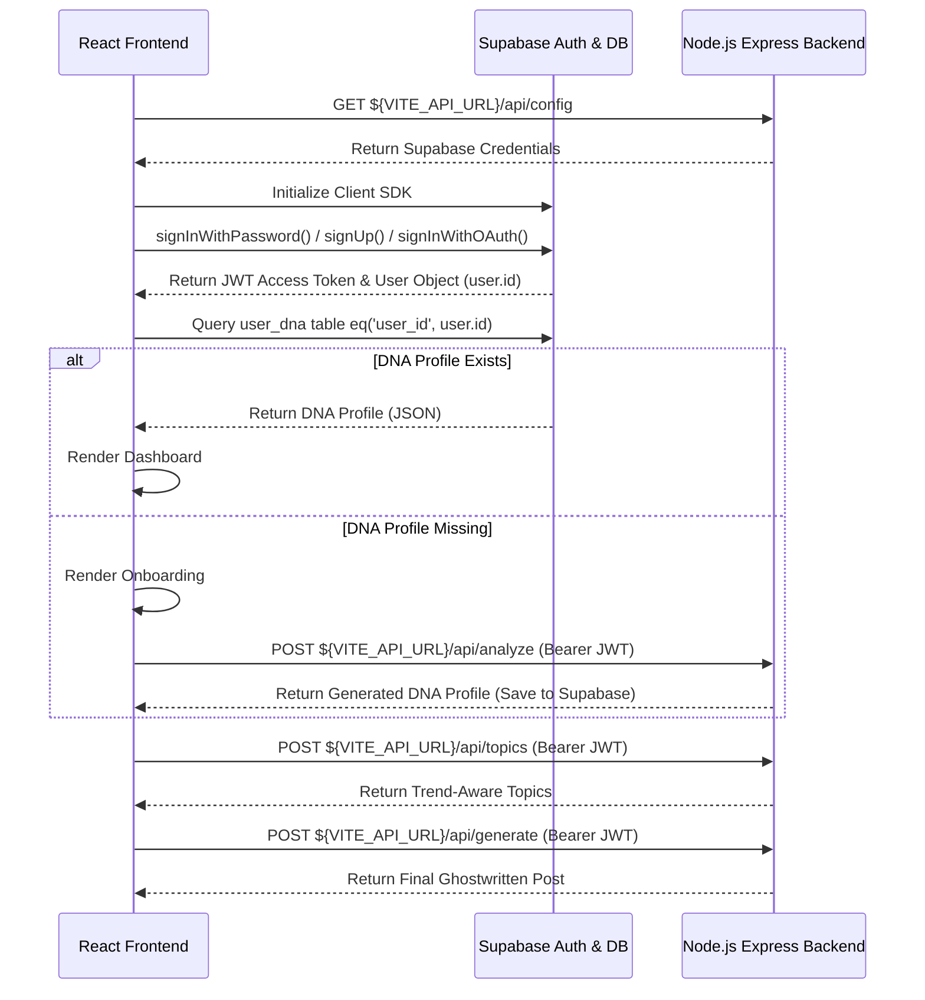

# Developer Hand-Off Guide: AI LinkedIn Post Generator Frontend

This document outlines the architecture, visual system, state workflows, and API/Supabase integration configurations for the frontend of the **AI LinkedIn Post Generator**.

---

## 1. Project Specifications

- **Framework**: React 19 + TypeScript + Vite
- **Styling**: Tailwind CSS v4 (latest stable) using CSS-first customizations in [src/index.css](file:///Users/hexahealth/Documents/Personal/linkedin-post-generator-frontend/src/index.css)
- **Database & Auth Integration**: Supabase (PostgreSQL + JWT Authentication)
- **Local Dev Server**: Runs on [http://localhost:5174/](http://localhost:5174/) (default fallback if 5173 is in use)

---

## 2. Environment Configurations

All environment values are stored in the local [.env](file:///Users/hexahealth/Documents/Personal/linkedin-post-generator-frontend/.env) file:

- **`VITE_API_URL`**: `http://localhost:3000` (in local development). 
- **Production Update**: When deploying, update this variable to point to the server URL (e.g., `https://your-api.railway.app`).

---

## 3. Directory & Component Structure

All UI layouts reside under [src/components/](file:///Users/hexahealth/Documents/Personal/linkedin-post-generator-frontend/src/components):

| Component File | Role / Responsibility |
| :--- | :--- |
| [App.tsx](file:///Users/hexahealth/Documents/Personal/linkedin-post-generator-frontend/src/App.tsx) | Handles Supabase auth state change listeners, fetches/updates user DNA profiles directly from Supabase DB, and triggers DNA analyzer API. |
| [Auth.tsx](file:///Users/hexahealth/Documents/Personal/linkedin-post-generator-frontend/src/components/Auth.tsx) | Handles email/password sign-in (`signInWithPassword`), sign-up (`signUp`), and Google OAuth (`signInWithOAuth`). |
| [Onboarding.tsx](file:///Users/hexahealth/Documents/Personal/linkedin-post-generator-frontend/src/components/Onboarding.tsx) | Multi-post input textareas (minimum 5, unlimited maximum), validation limits, and sample loaders. |
| [Loader.tsx](file:///Users/hexahealth/Documents/Personal/linkedin-post-generator-frontend/src/components/Loader.tsx) | Orb spinner loading indicator that maps rotating analysis statuses and coordinates transition with backend resolves. |
| [ProfileDashboard.tsx](file:///Users/hexahealth/Documents/Personal/linkedin-post-generator-frontend/src/components/ProfileDashboard.tsx) | Compiles profile DNA metrics into dashboard widgets and syncs custom parameter updates directly to the Supabase database. |
| [TopicGenerator.tsx](file:///Users/hexahealth/Documents/Personal/linkedin-post-generator-frontend/src/components/TopicGenerator.tsx) | Calls `/api/topics` to fetch trending ideas from Tavily + Groq. Calls `/api/generate` to ghostwrite draft posts, and renders copy-to-clipboard markdown containers. |

---

## 4. API & Supabase Integration Flow



---

## 5. Development Execution

1. **Install Frontend Dependencies**:
   ```bash
   npm install
   ```

2. **Run Dev Server**:
   ```bash
   npm run dev
   ```

3. **Build Production Bundle**:
   ```bash
   npm run build
   ```
   *Result*: Produces optimized assets in `/dist` directory.
